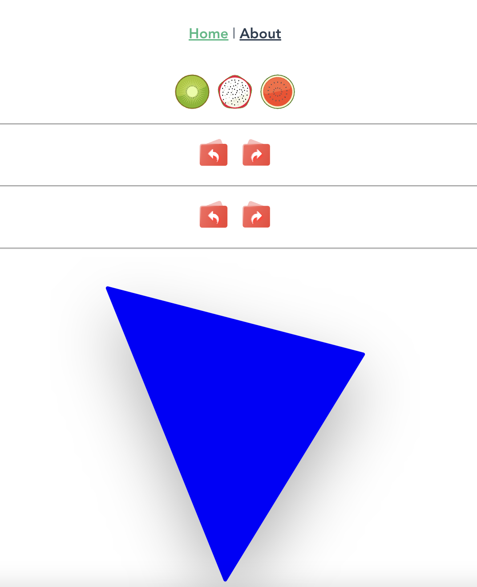
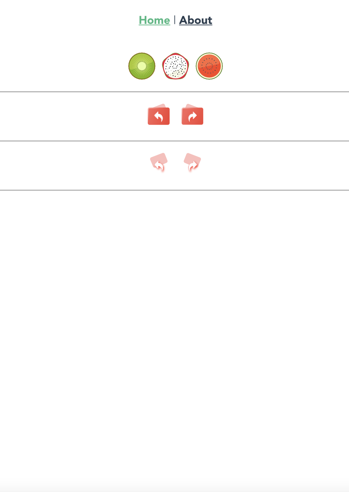
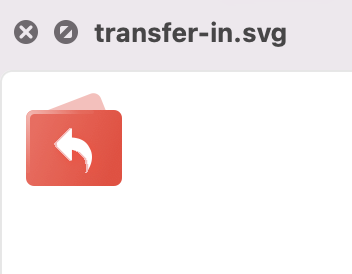
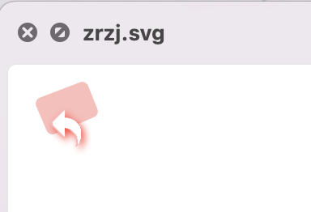

# vue2-svg-icon

```bash
npm i -D svg-sprite-loader
```

## Reference

* https://juejin.cn/post/6844903517564436493
* https://developer.mozilla.org/en-US/docs/Web/SVG/Attribute/xlink:href#use
* https://cloud.tencent.com/developer/section/1424047

## svg在chrome显示正常



## svg在safari显示异常



## svg在本地预览正常



## svg在本地预览异常



结论：部分使用了filter的svg在Safari显示会异常。参考[链接](https://stackoverflow.com/questions/44900980/svg-filter-works-in-chrome-but-not-in-safari-or-firefox)
